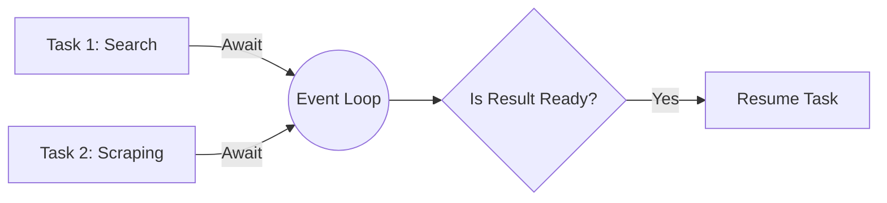

# Async Programming for Agents

**Module:** 1 | **Level:** Novice | **XP:** 40 | **Estimated Time:** 3 hours

<XpTracker />

## Learning Objectives
- Understand the **Event Loop** in Python.
- Master `async/await` syntax for non-blocking I/O.
- Learn to use `asyncio.gather()` for parallel agent tasks.
- Implement **Concurrency** without the overhead of threads.

## Why This Matters (Real-world Impact)
Agentic AI systems are **I/O bound**. Most of the time, an agent is waiting for an LLM response, a database query, or a web search result. Without async programming, your agent is "frozen" while waiting. 
- *Example:* An agent that needs to search 5 engines simultaneously. With synchronous code, it takes 5x longer. With **Async**, it takes only as long as the slowest engine.

## Core Concepts

### 1. The Event Loop
Think of the event loop as the "manager" of your agent. It schedules tasks and switches between them whenever one is waiting for I/O.


### 2. Async/Await Syntax
```python
import asyncio

async def fetch_llm_response(prompt):
    print(f"Sending prompt: {prompt}")
    await asyncio.sleep(2)  # Simulating network latency
    return f"Response to {prompt}"
```

## Real-World Examples
1. **Multi-Step Tool Execution:** An agent that starts a database query and a web search at the same time.
2. **Streaming LLM Outputs:** Using `async for` to process chunks of text as they arrive from Gemini or OpenAI.

## Code Examples (Python)

### 1. Parallel Task Execution
```python
import asyncio

async def call_tool(name, duration):
    print(f"Tool {name} started.")
    await asyncio.sleep(duration)
    print(f"Tool {name} finished after {duration}s.")
    return f"{name} result"

async def main():
    # Run tools in parallel
    results = await asyncio.gather(
        call_tool("Search", 2),
        call_tool("Database", 1),
        call_tool("ImageReader", 3)
    )
    print(f"All results collected: {results}")

if __name__ == "__main__":
    asyncio.run(main())
```

### 2. Async Context Managers
```python
class AgentSession:
    async def __aenter__(self):
        print("Starting Async Agent Session...")
        return self
    
    async def __aexit__(self, exc_type, exc, tb):
        print("Closing Async Agent Session...")

async def run_agent():
    async with AgentSession() as session:
        print("Agent is thinking...")
```

## Best Practices & Pro Tips
- **Don't use `time.sleep()`** in async code! It blocks the *entire* loop. Use `asyncio.sleep()`.
- **Use `asyncio.create_task()`** for fire-and-forget background operations.
- **Limit Concurrency:** Use `asyncio.Semaphore(10)` to avoid hitting API rate limits.

## Common Pitfalls & How to Avoid Them
- **Forgetting the `await`:** If you don't await a coroutine, it returns a "coroutine object" but never executes the code inside.
- **Blocking the Loop:** Heavily CPU-bound tasks (like image processing) should be run in a separate thread/process using `loop.run_in_executor`.

## Hands-on Exercises / Homework
- **Beginner:** Write an async function that mimics an LLM delay of 1 second and then returns "Thinking complete."
- **Intermediate:** Use `asyncio.gather` to "fetch" data from three different mock URLs simultaneously.
- **Advanced:** Implement a simple "Task Scheduler" that takes a list of coroutines and runs them with a maximum concurrent limit of 2.

## Gamified Challenge
**Story:** Your agent, *Sparky*, is trying to order pizza AND call a taxi at the same time.
- *Challenge:* Create two async functions `order_pizza()` and `call_taxi()`. Use `asyncio.gather()` to make sure Sparky does both efficiently, and print the total time taken (it should be less than the sum of both individual times!).

## Knowledge Check – MCQs
1. **What command do you use to run multiple async tasks at once?**
   - A) `asyncio.run()`
   - B) `asyncio.gather()`
   - C) `asyncio.wait_for_loop()`
2. **What happens if you use `time.sleep(5)` inside an async function?**
   - A) Only that function sleeps.
   - B) The entire program (and all other pending tasks) stops for 5 seconds.
   - C) Python throws an `AsyncError`.

---
**© 2026 APT Computing Labs** – Apache License 2.0

<ModuleCompletion moduleId="1-async-programming" :xpValue="40" />
