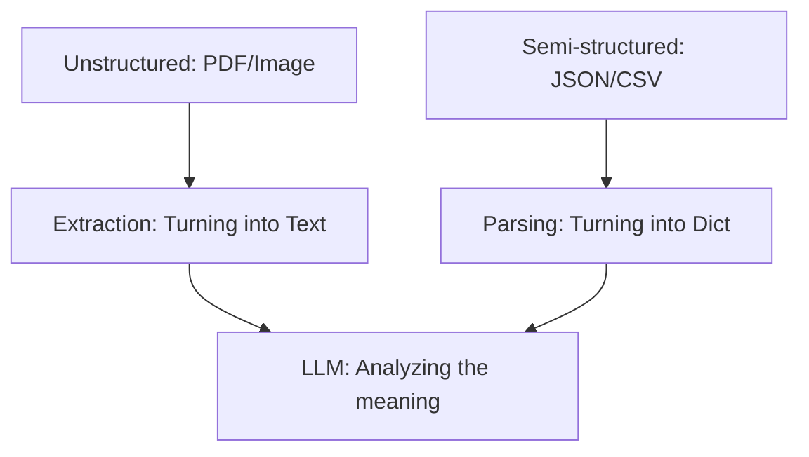

# Data Handling for AI Engineers

**Module:** 1 | **Level:** Novice | **XP:** 50 | **Estimated Time:** 3 hours

<XpTracker />

## Learning Objectives
- Master **JSON, CSV, and TXT** manipulation in Python.
- Extract text from **PDFs** and **Markdown** files.
- Basic **Image Metadata** extraction.
- Learn **File I/O** (Input/Output) patterns for agent memory.
- Understand **Serialization & Deserialization** (JSON string vs Python dict).

## Why This Matters (Real-world Impact)
Data is the "fuel" for your agent. If an agent can't read a PDF, it can't summarize your latest report. If it can't read a CSV, it can't analyze your sales numbers.
- *Example:* A data analysis agent that reads 10+ CSV spreadsheets and produces a single, beautiful JSON summary.

## Core Concepts

### 1. The Data Hierarchy
How do agents see data? It's all about conversion to text for LLMs.


### 2. Serialization (Saving the Agent's Brain)
When an agent finishes a task, it must **serialize** its memory to a file (like JSON) so it can pick up where it left off next time.
```python
import json

agent_state = {"last_page": 4, "xp": 1500}
# Save to file
with open("agent_save.json", "w") as f:
    json.dump(agent_state, f)
```

## Real-World Examples
1. **Report Summary Assistant:** An agent that opens 5 PDFs, extracts the text, and writes a single `.txt` file with the final summary.
2. **Sales Analytics Agent:** Reading a 1000-line CSV and calculating the total revenue for the top 5 products.

## Code Examples (Python)

### 1. Handling JSON Data
```python
import json

raw_json = '{"name": "Agentic AI", "level": "Master"}'
# Deserialization (String to Dict)
data = json.loads(raw_json)
print(f"Agent Name: {data['name']}")

# Serialization (Dict to String)
new_json = json.dumps(data, indent=2)
print(new_json)
```

### 2. Reading a CSV (Spreadsheet)
```python
import csv

def read_sales_data(filename: str):
    with open(filename, newline='') as csvfile:
        reader = csv.DictReader(csvfile)
        for row in reader:
            print(f"Product: {row['Product']}, Price: {row['Price']}")

# Usage
# read_sales_data("sales.csv")
```

## Best Practices & Pro Tips
- **Use `pathlib`** for file paths. It's safer and cleaner than using raw strings. 
- **Graceful Error Handling.** If a file is missing, your agent should print: "Error: File not found," instead of crashing.
- **Use `f-strings`** for dynamic filenames (e.g., `f"report_{user_id}.pdf"`).

## Common Pitfalls & How to Avoid Them
- **Memory Overload:** Never read a 1GB CSV file into memory all at once. Use "streaming" or "chunking."
- **Wrong Character Encoding:** If you see weird symbols, you're probably using the wrong encoding. Use `encoding="utf-8"`.

## Hands-on Exercises / Homework
- **Beginner:** Create a dictionary and save it to a file called `my_data.json`.
- **Intermediate:** Write a script that reads a text file and counts how many times the word "AI" appears.
- **Advanced:** Create a list of 5 dictionaries (e.g., product data) and save it as a CSV file using the `csv` module.

## Gamified Challenge
**Story:** Your agent, *Scribe*, has found a "Lost Treasure Map" in a JSON file.
- *Challenge:* Read a mock JSON file called `map.json` and extract the value of the `x` and `y` coordinates. Print: "Moving to coordinates ([x], [y])."

## Knowledge Check – MCQs
1. **What is 'Serialization'?**
   - A) Turning text into an image.
   - B) Converting a Python object into a string for storage or transmission.
   - C) Deleting old data.
2. **Which file format is most commonly used for LLM interaction?**
   - A) Excel (XLSX)
   - B) JSON
   - C) Word (DOCX)

---
**© 2026 APT Computing Labs** – Apache License 2.0

<ModuleCompletion moduleId="1-data-handling" :xpValue="50" />
