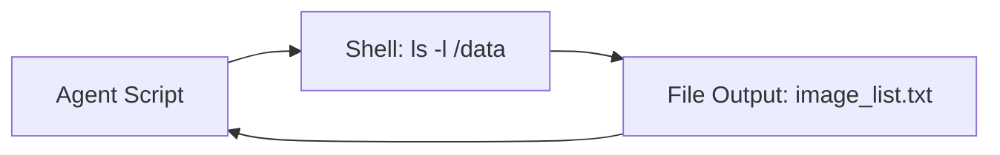

# Linux Basics for AI Engineers

**Module:** 1 | **Level:** Novice | **XP:** 40 | **Estimated Time:** 2 hours

<XpTracker />

## Learning Objectives
- Master the **Terminal & Shell** for agentic automation.
- Understand **File Permissions** and paths.
- Manage **Processes & Logs** (ps, top, tail).
- Use **Environment Variables** (`.env`) securely.
- Basic **Networking** for agent communication (ping, curl, localhost).

## Why This Matters (Real-world Impact)
Your agent doesn't live in a vacuum. It lives on a **Terminal**. If an agent can't find its own logs or can't read a `.env` file, it's useless.
- *Example:* An agent that stops working because its log file became 10GB and crashed the server's memory.

## Core Concepts

### 1. The Power of CLI (Command Line Interface)
Why use the shell for AI? It's faster to automate!


### 2. Environment Variables: The Agent's Secrets
Instead of hardcoding your API key, you store it in the environment.
```bash
# Setting a key temporarily
export GEMINI_API_KEY="AIzaSy..."

# Checking a key
echo $GEMINI_API_KEY
```

## Real-World Examples
1. **Log Monitoring Agent:** Using `tail -f agent_log.txt` to watch an agent's thoughts in real-time.
2. **Process Master Agent:** Using `kill -9 1234` to stop an agent that's stuck in an infinite loop.

## Code Examples (Bash & Python)

### 1. Basic CLI Commands
```bash
# Create a folder for your agent's knowledge
mkdir -p ./data/knowledge_base

# List files with sizes
ls -lh ./data

# Find a specific log entry
grep "ERROR" agent_execution.log
```

### 2. Accessing Env Vars in Python
```python
import os

api_key = os.getenv("GEMINI_API_KEY")

if not api_key:
    print("⚠️ Error: GEMINI_API_KEY is not set in the environment.")
else:
    print("✅ Successfully loaded API Key from Linux environment.")
```

## Best Practices & Pro Tips
- **Use `relative paths`** (e.g., `./data`) in your scripts so they work on any machine.
- **Log Everything.** Use `logging` in Python to write output to a `logs/` folder.
- **Check Disk Space.** Agents that generate lots of data (images/videos) can fill up a drive quickly. Use `df -h`.

## Common Pitfalls & How to Avoid Them
- **Hardcoding Paths:** `C:\Users\Name\Desktop` will NOT work on a Linux server. Use `os.path.join`.
- **Permissions Errors:** If your agent can't write its log, it's because it doesn't have `write` permission for that folder. Use `chmod +x`.

## Hands-on Exercises / Homework
- **Beginner:** Open your terminal and create a folder called `agent_workspace`. Create an empty file inside called `thoughts.txt`.
- **Intermediate:** Use the `echo` command to save your name to a file and the `cat` command to read it back.
- **Advanced:** Write a Python script that reads an environment variable called `AGENT_NAME` and prints: "Hello, my name is [name]."

## Gamified Challenge
**Story:** You are the *Terminal Guardian* for the *AI Grid*.
- *Challenge:* Create a bash script (or Python simulation) that checks if a file called `secret.env` exists. If it does, print "System Secure." If not, print "Warning: Breach Detected!"

## Knowledge Check – MCQs
1. **Which command is used to read the last 10 lines of a file?**
   - A) `head`
   - B) `tail`
   - C) `list`
2. **Where should you store your LLM API Keys on a Linux server?**
   - A) In the README.md file.
   - B) In an Environment Variable or a `.env` file.
   - C) Hardcoded in the script.

---
**© 2026 APT Computing Labs** – Apache License 2.0

<ModuleCompletion moduleId="1-linux-basics" :xpValue="40" />
