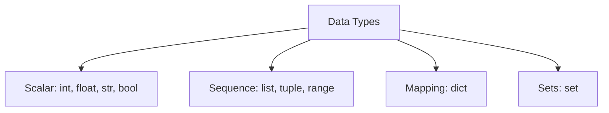

# Python Programming Essentials

**Module:** 1 | **Level:** Novice | **XP:** 30 | **Estimated Time:** 2 hours

## Learning Objectives
- Master **Modern Python (3.10+)** syntax and data types.
- Understand **Functional & Object-Oriented Programming** for AI systems.
- Use **Type Hinting** and **Pydantic** for structured AI outputs.
- Write highly readable, scalable, and resilient Python scripts for autonomous agents.

## Why This Matters (Real-world Impact)
In 2026, **Agentic AI** isn't just about prompts; it's about the **code** that executes those prompts. Autonomous agents need to handle data, make logic-based decisions, and integrate with external APIs. Without a robust Python foundation, your agents will be fragile and unreliable.
- *Example:* A research agent needs to scrape 50+ URLs and store the data in a specific JSON format. Poor error handling in Python would cause it to crash halfway through.

## Core Concepts

### 1. Modern Syntax & Data Types
Modern Python handles data efficiently using **List Comprehensions**, **Dictionary Merging**, and **f-strings**.


### 2. Type Hinting (The AI Essential)
When building agents, **type safety** is critical for tool-calling validation.
```python
from typing import List, Dict

def process_agent_response(response: str, tags: List[str]) -> Dict[str, any]:
    # Returns a dictionary for the agent's internal state
    return {"status": "success", "length": len(response)}
```

## Real-World Examples
1. **Dynamic Task Scaling:** An agent script that uses `range` and `itertools` to batch-process 1000 tasks without overloading memory.
2. **Schema Validation:** Using `typing` to ensure an LLM's output matches the expected JSON structure before passing it to a database.

## Code Examples (Python)

### 1. Advanced Python Logic
```python
# Modern Python Dictionary Merging (3.9+)
config = {"model": "gemini-1.5-pro"}
overrides = {"temperature": 0.7, "top_p": 0.9}
final_config = config | overrides
print(f"Agent Config: {final_config}")

# Flexible List Comprehension
raw_tasks = ["task_1", "  task_2  ", "TASK_3", ""]
cleaned_tasks = [t.strip().lower() for t in raw_tasks if t.strip()]
print(f"Cleaned Tasks: {cleaned_tasks}")
```

### 2. Structured Agent State with Classes
```python
class AgentState:
    def __init__(self, agent_id: str):
        self.agent_id = agent_id
        self.memory = []
    
    def log_action(self, action: str):
        self.memory.append(action)
        print(f"[{self.agent_id}] Logged: {action}")

# Usage
my_agent = AgentState("ResearchAgent-01")
my_agent.log_action("Scraping Google News...")
```

## Best Practices & Pro Tips
- **Always use `f-strings`** for dynamic prompt generation.
- **Avoid Global State:** It ruins multi-agent coordination. Use classes or state-management objects.
- **Leverage `__slots__`** in large-scale agents to save memory.

## Common Pitfalls & How to Avoid Them
- **Mutable Default Arguments:** Never use `def fn(data=[])`. Use `def fn(data=None)`.
- **Ignoring Exceptions:** Agents can fail for many reasons (network issues, LLM timeout). Use `try-except` blocks generously.

## Hands-on Exercises / Homework

- **Beginner:** Create a script that takes a list of agent names and filters out any that are inactive (shorter than 5 characters).
- **Intermediate:** Build a class `AgentConfig` that stores credentials and uses type hints to validate inputs.
- **Advanced:** Write a generator function that yields "tasks" from a JSON list only if they contain the keyword "URGENT."

## Gamified Challenge
**Story:** You are an AI Engineer at *Apex Agents*. Your task is to build a "System Cleaner" script for your first autonomous agent.
- *Challenge:* Create a function `sanitize_logs(raw_data: str) -> list` that removes all numbers (which might be sensitive data) and splits the logs into a list of clean words.

## Knowledge Check – MCQs
1. **Which Python feature is best for structured AI data?**
   - A) Lists
   - B) Dictionary Merging
   - C) Classes & Type Hinting
2. **What happens if you use `def add_task(tasks=[])`?**
   - A) It works perfectly.
   - B) The list persists across function calls, creating a "memory leak."
   - C) The application crashes.

---
---
**© 2026 APT Computing Labs** – Apache License 2.0

<ModuleCompletion moduleId="1-python-essentials" :xpValue="30" />
