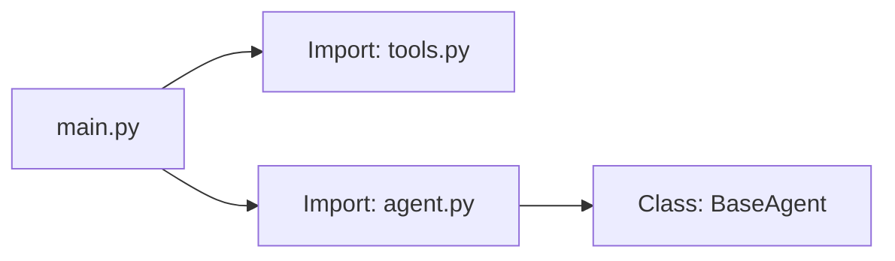

# Python Programming Essentials

**Module:** 1 | **Level:** Novice | **XP:** 30 | **Estimated Time:** 2 hours

<XpTracker />

## Learning Objectives
- Master **Modern Python (3.10+)** core syntax and built-in data structures.
- Implement **Conditional Logic & Loops** for decision-making agents.
- Understand **Object-Oriented Programming (OOPS)** for stateful agent design.
- Use **Modules & Packages** to organize complex AI codebases.
- Leverage **Type Hinting** for robust tool-calling validation.

## Why This Matters (Real-world Impact)
In 2026, **Agentic AI** isn't just about prompts; it's about the **code** that executes those prompts. Autonomous agents need to handle data, make logic-based decisions, and integrate with external APIs. Without a robust Python foundation, your agents will be fragile and unreliable.
- *Example:* A research agent needs to scrape 50+ URLs and store the data in a specific JSON format. Poor error handling or logic in Python would cause it to crash halfway through.

## Core Concepts

### 1. Data Structures: The Agent's Toolkit
How an agent stores and retrieves information depends on the structure:
- **Lists:** Ordered sequences (e.g., `["task1", "task2"]`).
- **Dictionaries:** Key-value pairs for structured data (e.g., `{"name": "Agent1", "role": "Researcher"}`).
- **Sets:** Unordered unique items (e.g., `{"apple", "banana"}`).
- **Tuples:** Immutable sequences for fixed configurations.

### 2. Control Flow: the Agent's "Brain"
Agents use **Conditions** (`if/elif/else`) to branch logic and **Loops** (`for/while`) to iterate over tasks.
```python
tasks = ["analyze", "summarize", "post"]

for task in tasks:
    if task == "summarize":
        print("💡 Summarization step detected.")
    else:
        print(f"⚙️ Executing: {task}")
```

### 3. OOPS & Modules
For complex agents, we use **Classes** to manage state and **Modules** to keep the code clean.


## Real-World Examples
1. **Dynamic Task Scaling:** An agent script that uses `range` and `itertools` to batch-process 1000 tasks without overloading memory.
2. **Schema Validation:** Using `typing` and classes to ensure an LLM's output matches the expected JSON structure.

## Code Examples (Python)

### 1. Advanced Logic & Data Handling
```python
# Modern Python Dictionary Merging (3.9+)
config = {"model": "gemini-1.5-pro"}
overrides = {"temperature": 0.7, "top_p": 0.9}
final_config = config | overrides

# Conditional Logic for Agent Dispatching
def dispatch_agent(task_type: str):
    match task_type: # Python 3.10 Pattern Matching
        case "research": return "🔍 Researcher"
        case "coding": return "💻 Developer"
        case _: return "🤖 General Assistant"

print(dispatch_agent("coding"))
```

### 2. OOPS for Stateful Agents
```python
class Agent:
    def __init__(self, name: str, role: str):
        self.name = name
        self.role = role
        self.memory = []

    def perform_action(self, action: str):
        self.memory.append(action)
        return f"[{self.name}] Acting as {self.role}: {action}"

# Create an instance
my_agent = Agent("Nexus", "Researcher")
print(my_agent.perform_action("Scanning news..."))
```

## Best Practices & Pro Tips
- **Always use `f-strings`** for dynamic prompt generation.
- **Avoid Global State:** Use classes or state-management objects to prevent multi-agent confusion.
- **Type Hinting:** Use `from typing import List, Dict` to help AI coding assistants understand your code better.

## Common Pitfalls & How to Avoid Them
- **Mutable Default Arguments:** Never use `def fn(data=[])`. Use `def fn(data=None)`.
- **Indentation Errors:** Python relies on whitespace. Always use 4 spaces per level.
- **Ignoring Exceptions:** Use `try/except` for network calls or LLM interactions.

## Hands-on Exercises / Homework
- **Beginner:** Create a list of 5 agent names and use a `for` loop to print them all in uppercase.
- **Intermediate:** Build a class `AgentConfig` that takes a dictionary and sets its attributes dynamically.
- **Advanced:** Write a module `utils.py` that contains a function to clean text, and import it into a `main.py` script.

## Gamified Challenge
**Story:** Your agent, *Cipher*, needs to sort a list of incoming "Message Packets."
- *Challenge:* Create a function `sort_packets(packets: list) -> dict`. It should take a list of strings, sort them into two categories in a dictionary: `internal` (if they start with 'INT_') and `external` (all others).

## Knowledge Check – MCQs
1. **Which Python feature is best for structured AI data?**
   - A) Simple Lists
   - B) Dictionary Merging
   - C) Classes & Type Hinting
2. **What is 'Inheritance' in OOPS?**
   - A) Getting money from a relative.
   - B) A way for a new class to take on the properties of an existing class.
   - C) A method to delete variables.

---
**© 2026 APT Computing Labs** – Apache License 2.0

<ModuleCompletion moduleId="1-python-essentials" :xpValue="30" />
