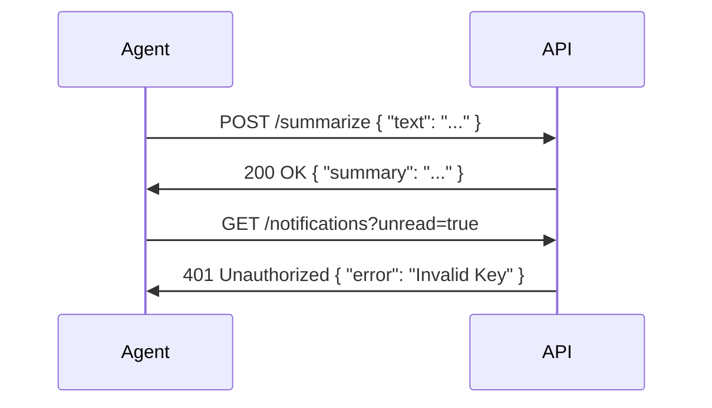

# REST APIs & JSON Handling

**Module:** 1 | **Level:** Novice | **XP:** 50 | **Estimated Time:** 3 hours

<XpTracker />

## Learning Objectives
- Master the **HTTP Methods** (GET, POST, PUT, DELETE).
- Understand **Status Codes** (200, 401, 404, 500).
- Parse and manipulate **JSON** data in Python.
- Use `requests` and `httpx` to interact with external LLM APIs.
- Implement **Authentication Headers** securely.

## Why This Matters (Real-world Impact)
An Agent's "ears" and "mouth" are often REST APIs. Whether it's calling Gemini, searching Google, or posting to Slack, the agent must speak the language of **JSON over HTTP**.
- *Example:* An agent that automatically checks your GitHub notifications and summarizes them every morning.

## Core Concepts

### 1. The Anatomy of an API Call


### 2. JSON: The Lingua Franca of AI
JSON is just a dictionary in a string format. 
```json
{
  "agent_id": "ResearchBot-1",
  "capabilities": ["search", "math", "code"],
  "stats": { "xp": 1500, "level": "Master" }
}
```

## Real-World Examples
1. **Financial Agent:** Calling `alpha_vantage` API to get the latest stock price and parsing it for a prompt.
2. **Social Media Agent:** Posting a generated comment to a URL using a `POST` request with an `auth` token.

## Code Examples (Python)

### 1. Fetching Data (GET)
```python
import requests

def get_crypto_price(coin_id: str):
    url = f"https://api.coingecko.com/api/v3/simple/price?ids={coin_id}&vs_currencies=usd"
    response = requests.get(url)
    
    if response.status_code == 200:
        data = response.json()
        price = data[coin_id]['usd']
        return f"The price of {coin_id} is ${price}."
    return "Error: Could not retrieve price."

print(get_crypto_price("bitcoin"))
```

### 2. Sending Data (POST)
```python
def send_report(report_data: dict):
    webhook_url = "https://hooks.slack.com/services/T000.../B000..."
    headers = {"Content-Type": "application/json"}
    
    response = requests.post(webhook_url, json=report_data, headers=headers)
    return response.status_code == 200

# Usage
# send_report({"text": "Hello from my Agentic UI!"})
```

## Best Practices & Pro Tips
- **Use `httpx`** instead of `requests` for async agent systems. 
- **Always set a Timeout.** Never let an agent wait forever for a slow API.
- **Hide Your Keys.** Never hardcode your API keys in the script. Use `.env` files.

## Common Pitfalls & How to Avoid Them
- **Ignoring Rate Limits:** If you call an API too fast (e.g., 100 times/sec), you'll get a 429 error. Use `time.sleep()` or async throttling.
- **Parsing Errors:** If the API returns something that isn't JSON (like a 404 HTML page), `response.json()` will crash. Check `status_code` first!

## Hands-on Exercises / Homework
- **Beginner:** Write a script that prints a "Hello World" message in JSON format.
- **Intermediate:** Use the `requests` library to fetch a random joke from a public API and print just the joke text.
- **Advanced:** Build a function that takes a dictionary, converts it to a JSON string, and then converts it back to a dictionary.

## Gamified Challenge
**Story:** Your agent, *Relay*, is trying to talk to the "Ancient Knowledge API."
- *Challenge:* Write a function `fetch_ancient_scroll(scroll_id: int)` that calls a mock API URL. If the API returns a 404, capture the error and print: "Sorry, that scroll was lost in history."

## Knowledge Check – MCQs
1. **Which HTTP method is best for 'retrieving' data?**
   - A) POST
   - B) GET
   - C) DELETE
2. **What does a 401 status code mean?**
   - A) Page Not Found
   - B) Unauthorized (Invalid API Key)
   - C) Everything is OK

---
**© 2026 APT Computing Labs** – Apache License 2.0

<ModuleCompletion moduleId="1-rest-apis" :xpValue="50" />
