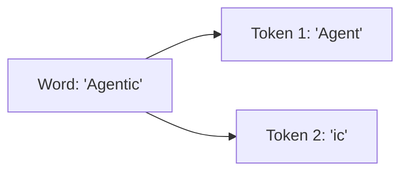

# LLM Fundamentals

**Module:** 2 | **Level:** Apprentice | **XP:** 60 | **Estimated Time:** 2 hours

<XpTracker />

## Learning Objectives
- Master the concepts of **Tokens** and **Tokenization**.
- Understand **Context Windows** and how they affect agent memory.
- Learn the role of **Temperature**, **Top-P**, and **Presence Penalty**.
- Differentiate between **Encoder-Only**, **Decoder-Only**, and **Encoder-Decoder** architectures.

## Why This Matters (Real-world Impact)
An agent's IQ depends on how it perceives language. If you don't understand how an LLM "sees" words as numbers, you'll waste money on tokens and hit context limits unexpectedly.
- *Example:* Feeding a 500-page PDF into a model with only an 8k context window results in "memory loss" where the agent forgets the beginning of the document.

## Core Concepts

### 1. What is a Token?
LLMs don't read words. They read **Tokens**. A token is roughly 4 characters or 0.75 words.


### 2. The Context Window
This is the agent's "working memory." If the conversation exceeds this limit, the agent will "forget" the earlier parts of the chat.
Modern models (2026) like Gemini 2.0 have **2M+ context windows**, allowing you to feed entire codebases into the agent.

## Real-World Examples
1. **Dynamic Prompting:** Truncating user history to stay within an LLMs token limit to avoid performance drops.
2. **Temperature Control:** Setting `temperature=0` for coding tasks (strict) and `temperature=0.8` for creative brainstorming (diverse).

## Code Examples (Python)

### 1. Estimating Tokens
```python
# Simple heuristic: 1 token ~= 4 chars
def estimate_tokens(text: str) -> int:
    return len(text) // 4

chat_history = "This is a long conversation between a user and an agent..."
print(f"Estimated Tokens: {estimate_tokens(chat_history)}")
```

### 2. Managing Context
```python
def truncate_to_context(prompt_list: list, max_tokens: int):
    # A simplified context window function
    current_tokens = 0
    truncated_list = []
    
    for prompt in reversed(prompt_list):
        current_tokens += len(prompt) // 4
        if current_tokens > max_tokens:
            break
        truncated_list.append(prompt)
    
    return list(reversed(truncated_list))
```

## Best Practices & Pro Tips
- **Always use `temperature=0`** for agents that call tools. High temperature makes them hallucinate function names.
- **Use Tiktoken (OpenAI)** or the specific provider's library for accurate token counting.

## Hands-on Exercises / Homework
- **Beginner:** Write a script that takes a sentence and estimates how many tokens it represents using the 4-character rule.
- **Intermediate:** Experiment with a model's temperature settings (0, 0.5, 1.0) and observe how the output changes for the same prompt.
- **Advanced:** Build a "Context Trimmer" that keeps the last 5 messages AND the system prompt, but deletes everything else.

## Gamified Challenge
**Story:** You are the *Gatekeeper* of the Core Model. Your resources are limited.
- *Challenge:* Write a function `can_send_to_ai(prompt: str, allowance: int) -> bool` that returns `True` only if the prompt is within your token allowance. If it's too long, print exactly how many characters need to be cut.

## Knowledge Check – MCQs
1. **Roughly how many tokens are in 1000 words?**
   - A) 100
   - B) 750
   - C) 1300
2. **Which parameter controls the randomness of the model?**
   - A) Top-P
   - B) Temperature
   - C) Context Window

---
**© 2026 APT Computing Labs** – Apache License 2.0

<ModuleCompletion moduleId="2-llm-fundamentals" :xpValue="60" />
