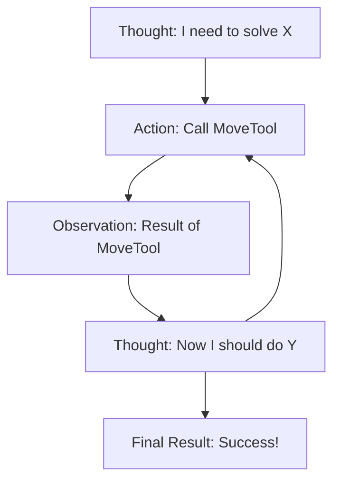

# Agent Architecture

**Module:** 3 | **Level:** Agent Builder | **XP:** 120 | **Estimated Time:** 5 hours

<XpTracker />
<Settings />

## Learning Objectives
- Master the **ReAct (Reason + Act)** loop.
- Understand the **Planner-Executor** pattern.
- Implement a **Reflection** loop for self-correction.
- Design agents with **Finite State Machines (FSM)**.
- Handle **Autonomous Loop Breaks** (when an agent gets stuck).

## Why This Matters (Real-world Impact)
An agent's architecture is its "brain structure." If you just give an LLM a list of tools, it might call them randomly. **Architecture** provides the logic that allows it to plan, verify its own work, and correct mistakes before showing the user.
- *Example:* A research agent that realizes its first search result was "out of date" and automatically decides to search again with a different date range.

## Core Concepts

### 1. The ReAct Loop (Reason + Act)
The foundational pattern of modern agents. The agent "Thinks" (Reason) before it "Acts" (Tool Call).


### 2. Planner-Executor Pattern
For complex tasks, we split the agent into two roles:
- **The Planner:** Creates a list of steps (Plan).
- **The Executor:** Takes one step at a time and calls the tools.
- **The Re-Planner:** Adjusts the plan based on the results of the executor.

## Real-World Examples
1. **Automated Coding Agent:** Planner (thinks of the app structure), Executor (writes the code), Reflector (runs the tests and fixes any bugs).
2. **Medical Diagnosis Assistant:** Think (symptoms), Act (check database), Observe (possible diseases), Think (next question for user), Loop.

## Code Examples (Python)

### 1. Simple ReAct Simulation
```python
def agent_loop(user_query: str):
    print(f"User: {user_query}")
    
    # Step 1: Reason
    thought = "I need to check the inventory to see if we have stocks."
    print(f"Thought: {thought}")
    
    # Step 2: Act (Tool Call)
    action = "inventory_api_call"
    print(f"Action: {action}")
    
    # Step 3: Observe
    observation = "10 units available."
    print(f"Observation: {observation}")
    
    # Step 4: Final Thought
    final_output = "We have 10 units in stock."
    print(f"Final Result: {final_output}")

# Usage
agent_loop("Check stock for Model X")
```

### 2. A Basic Planner List
```python
class AgentPlan:
    def __init__(self, goal: str):
        self.goal = goal
        self.steps = ["Step 1: Search", "Step 2: Analyze", "Step 3: Report"]
        self.current_step = 0
    
    def get_next_step(self):
        if self.current_step < len(self.steps):
            step = self.steps[self.current_step]
            self.current_step += 1
            return step
        return None

# Usage
plan = AgentPlan("Research 2026 AI Trends")
print(plan.get_next_step()) # Step 1: Search
```

## Best Practices & Pro Tips
- **Limit the Number of Steps.** Never let an agent loop more than 5-10 times without checking in with the user.
- **Use Multi-Prompting.** One prompt for planning, another for execution, and a third for verification.
- **Always provide a 'Stop' condition.** Make sure the agent can say "I give up" if it can't solve the problem.

## Common Pitfalls & How to Avoid Them
- **Infinite Loops:** The agent keeps calling the same tool over and over with the same arguments. 
  - *Fix:* Store the tool history and pass it back to the LLM so it knows what it already tried.
- **Lost Focus:** The agent starts researching a side-topic and forgets the original goal. 
  - *Fix:* Re-inject the "User Goal" into every step of the loop.

## Hands-on Exercises / Homework
- **Beginner:** Write a function that takes a "Problem" and prints a 3-step "Plan" for an agent to solve it.
- **Intermediate:** Create a simple "Reflection" loop where a function writes a sentence, then "Reflects" (finds a typo), then "Corrects" it.
- **Advanced:** Build a "ReAct Counter" that tracks how many times an agent has looped and stops it after 5 iterations.

## Gamified Challenge
**Story:** Your agent, *Voyager*, is navigating the *Logic Maze*.
- *Challenge:* Implement a class `AgentMind` that has a `think()` and an `act()` method. If the agent's "Thought" contains the word "Done," it must stop. If not, it must "Act" and loop again.

## Knowledge Check – MCQs
1. **What does 'ReAct' stand for?**
   - A) Receive and Active
   - B) Reason and Act
   - C) Report and Analyze
2. **What is the main role of a 'Planner'?**
   - A) To execute code.
   - B) To break down a complex task into smaller steps.
   - C) To delete old data.

---
**© 2026 APT Computing Labs** – Apache License 2.0

<ModuleCompletion moduleId="3-agent-architecture" :xpValue="120" />
