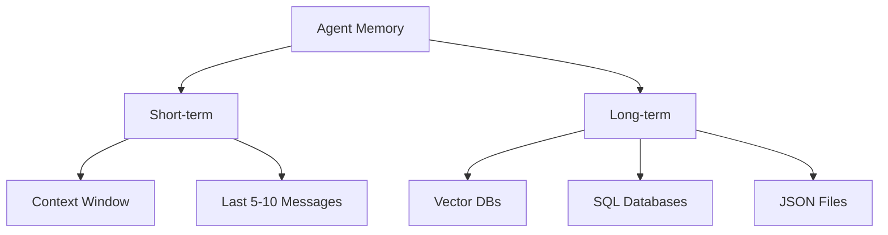

# Memory Systems for Agents

**Module:** 3 | **Level:** Agent Builder | **XP:** 90 | **Estimated Time:** 3 hours

<XpTracker />
<Settings />

## Learning Objectives
- Distinguish between **Short-term Memory** (Context) and **Long-term Memory** (Databases).
- Master **Vector Embeddings** and their role in memory.
- Implement **Context Management** and summarization.
- Store and retrieve user preferences across sessions.

## Why This Matters (Real-world Impact)
An agent with no memory has "dementia." It forgets your name, your past orders, and your specific instructions as soon as the context window is full.
- *Example:* A personalization agent that remembers your favorite coding language across months of interaction.

## Core Concepts

### 1. Types of Memory


### 2. Vector Embeddings
Embeddings are the **DNA of meaning**. They turn words into giant lists of numbers (vectors) so the agent can find "similar" concepts by calculating distances.
- *Similarity Example:* "King" is closer to "Queen" than to "Apple."

## Real-World Examples
1. **Chat History Summarization:** An agent that summarizes the first 20 tokens of a conversation to make space for more dialogue.
2. **Preference Mapping:** Storing a user's favorite Python framework in a profile that is loaded as a system prompt every time they log in.

## Code Examples (Python)

### 1. The Simple Chat Buffer
```python
class MessageBuffer:
    def __init__(self, limit: int = 5):
        self.history = []
        self.limit = limit
    
    def add(self, role: str, content: str):
        self.history.append({"role": role, "content": content})
        if len(self.history) > self.limit:
            self.history.pop(0) # Remove oldest
    
    def get_messages(self):
        return self.history

# Usage
chat = MessageBuffer(limit=2)
chat.add("user", "Hi!")
chat.add("ai", "Hello!")
chat.add("user", "Tell me a joke.")
print(chat.get_messages()) # Only the last 2 messages
```

### 2. Memory Summarization Logic
```python
def summarize_memory(old_messages: list):
    """A mock summarization loop"""
    summary = "User asked about AI and the agent responded politely."
    return [{"role": "system", "content": f"Previous conversation summary: {summary}"}]
```

## Best Practices & Pro Tips
- **Summarize proactively.** If the context is 80% full, trigger a "Summarizer" agent to condense it.
- **Use Metadata.** When saving to a long-term memory (Vector DB), store timestamps and categories.
- **Never store sensitive data (SSNs, passwords) in raw memory.**

## Common Pitfalls & How to Avoid Them
- **Memory Decay:** If the summary is poor, the agent loses important nuances over time.
- **Redundant Memory:** Storing the same information multiple times causes the LLM to get "stale" or repetitive.

## Hands-on Exercises / Homework
- **Beginner:** Create a `list` that only ever keeps the last 3 items using the `.pop(0)` method.
- **Intermediate:** Build a "User Profile Manager" that saves a user's favorite color to a JSON file and reads it back to personalize a greeting.
- **Advanced:** Implement a system that detects if a user's latest input is "too long" and summarizes it before adding it to history.

## Gamified Challenge
**Story:** Your agent, *Echo*, is suffering from memory overload.
- *Challenge:* Implement a class `EchoMemory` with a `remember(fact: str)` method. If the count of facts exceeds 5, the agent must "forget" the oldest one but print: "I've replaced my oldest memory with [new fact]."

## Knowledge Check – MCQs
1. **What is 'Short-term Memory' in an LLM?**
   - A) A Hard Drive
   - B) The Context Window
   - C) The weights of the model
2. **How are words compared in Vector Memory?**
   - A) By their length
   - B) By calculating 'distance' between numerical vectors
   - C) By alphabetical order

---
**© 2026 APT Computing Labs** – Apache License 2.0

<ModuleCompletion moduleId="3-memory-systems" :xpValue="90" />
