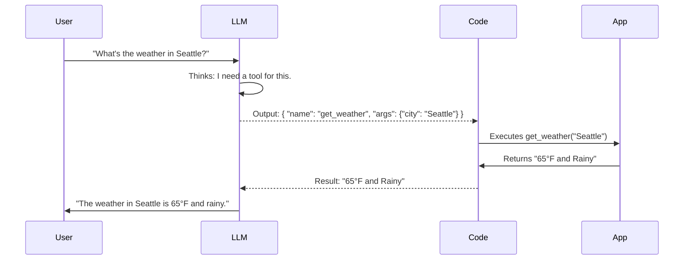

# Tool & Function Calling

**Module:** 3 | **Level:** Agent Builder | **XP:** 100 | **Estimated Time:** 4 hours

<XpTracker />
<Settings />

## Learning Objectives
- Master the **Function Calling Schema** (JSON Schema).
- Connect LLMs to real-world Python functions.
- Implement **Tool Selection** logic in autonomous agents.
- Handle multi-tool orchestration and error handling.

## Why This Matters (Real-world Impact)
An Agent without tools is just a chatbot. **Tool calling** is the "hands" of the agent. It allows the LLM to perform actions like searching the web, querying a database, or sending an email.
- *Example:* A customer support agent that can check an order status by calling a `get_order_info(order_id)` function instead of guessing.

## Core Concepts

### 1. The Tool Calling Lifecycle
Unlike traditional programming where you call a function, in Agentic AI, the **LLM chooses** to call the function by outputting a specific JSON schema.


### 2. Defining Tool Schemas
We use **Pydantic** or standard JSON dictionaries to define what a tool does.
```python
# The standard Schema for a tool
get_weather_tool = {
    "name": "get_weather",
    "description": "Get current weather for a city",
    "parameters": {
        "type": "object",
        "properties": {
            "city": {"type": "string", "description": "The city name"}
        },
        "required": ["city"]
    }
}
```

## Real-World Examples
1. **Financial Agent:** Using a `get_stock_price(symbol)` tool to provide real-time investment advice.
2. **System Admin Agent:** Using `list_active_processes()` and `stop_process(pid)` to manage a Linux server.

## Code Examples (Python)

### 1. Building a Tool-Enable Function
```python
def check_order_status(order_id: str):
    """Mock database lookup for order status"""
    mock_db = {"ORD123": "Shipped", "ORD456": "Pending"}
    return mock_db.get(order_id, "Order not found")

# Mapping the tool to the function
available_tools = {
    "check_order_status": check_order_status
}
```

### 2. Processing the LLM's Tool Choice
```python
def execute_tool(llm_choice):
    tool_name = llm_choice['name']
    tool_args = llm_choice['args']
    
    if tool_name in available_tools:
        result = available_tools[tool_name](**tool_args)
        return f"Tool result: {result}"
    return "Error: Tool not found."

# Simulating an LLM choice
mock_llm_output = {"name": "check_order_status", "args": {"order_id": "ORD123"}}
print(execute_tool(mock_llm_output))
```

## Best Practices & Pro Tips
- **Keep tool names simple and descriptive.**
- **Provide clear docstrings.** The LLM uses your description to decide when to use the tool.
- **Fail Gracefully.** If a tool fails, return an error message to the LLM so it can try to fix itself.

## Common Pitfalls & How to Avoid Them
- **Too many tools:** Giving an agent 50+ tools can confuse it (hallucination). Group them into smaller, specialized agents.
- **Security Risks:** Never give an agent broad tools like `execute_shell_command` without strict validation and sandboxing.

## Hands-on Exercises / Homework
- **Beginner:** Create a tool schema for a `multiply_numbers(a, b)` function.
- **Intermediate:** Create a tool that takes a `user_id` and returns a fake user profile. Write the logic to call it from a mock JSON output.
- **Advanced:** Build a "Calculator Agent" script that can handle `add`, `subtract`, and `multiply` tools by choosing the right one based on a user string.

## Gamified Challenge
**Story:** You are the Quartermaster for the *Agent Alliance*. You need to equip your agent with the "Universal Translator" tool.
- *Challenge:* Write a Python function `translate(text: str, language: str)` and its corresponding JSON schema. Make sure the schema forces the `language` argument to be one of `['French', 'Spanish', 'German']`.

## Knowledge Check – MCQs
1. **What tells the LLM how to use a tool?**
   - A) The Python code inside the function.
   - B) The JSON Schema and Description.
   - C) A system prompt only.
2. **What should you do if a tool returns an error?**
   - A) Crash the program.
   - B) Pass the error back to the LLM as a "Tool Output" so it can decide what to do next.
   - C) Ignore the error and tell the user everything is fine.

---
**© 2026 APT Computing Labs** – Apache License 2.0

<ModuleCompletion moduleId="3-tool-calling" :xpValue="100" />
