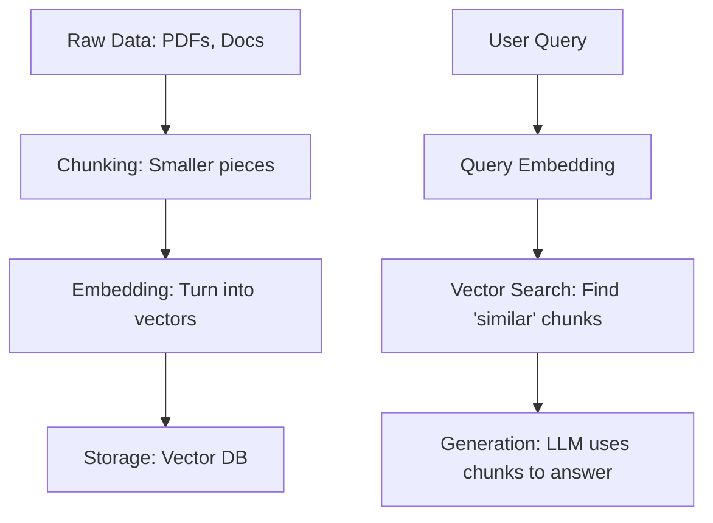

# RAG Fundamentals

**Module:** 4 | **Level:** Knowledge Engineer | **XP:** 120 | **Estimated Time:** 5 hours

<XpTracker />
<Settings />

## Learning Objectives
- Master the **ETL (Extract, Transform, Load)** pipeline for AI.
- Understand **Chunking Strategies** (Fixed-size, Semantic, Recursive).
- Learn **Vector Search** vs **Keyword Search**.
- Implement a basic retrieval loop using a vector database.

## Why This Matters (Real-world Impact)
An LLM's knowledge is frozen at its training cutoff date. **RAG (Retrieval-Augmented Generation)** allows your agent to "read" your company's private documents, real-time news, or fresh codebases.
- *Example:* A technical support agent that reads a new manual published yesterday to solve a customer's issue today.

## Core Concepts

### 1. The RAG Pipeline


### 2. Chunking Strategies
Should you split a book into pages, paragraphs, or sentences? 
- **Fixed-size:** 500 characters each. Simple, but breaks sentences.
- **Recursive:** Splits by paragraphs, then sentences. More accurate.
- **Semantic:** Uses an AI model to split where the *meaning* changes.

## Real-World Examples
1. **Financial Report Analyzer:** Using RAG to query 100+ quarterly reports for revenue trends.
2. **Medical Assistant agent:** Retrieving specific patient histories from a private database to suggest medications.

## Code Examples (Python)

### 1. Simple Semantic Chunking Logic
```python
def chunk_text(text: str, chunk_size: int = 100):
    """Splits text into chunks of roughly N characters"""
    words = text.split()
    chunks = []
    current_chunk = []
    current_len = 0
    
    for word in words:
        if current_len + len(word) > chunk_size:
            chunks.append(" ".join(current_chunk))
            current_chunk = [word]
            current_len = len(word)
        else:
            current_chunk.append(word)
            current_len += len(word) + 1
            
    if current_chunk:
        chunks.append(" ".join(current_chunk))
    return chunks

# Usage
doc = "This is a long document about Agentic AI. It covers RAG, Memory, and many other topics..."
print(f"Total Chunks: {len(chunk_text(doc))}")
```

### 2. The Retrieval Loop
```python
def retrieve_relevant_info(query: str, vector_db: list):
    """A mock search for the most 'similar' chunk"""
    # In reality, you'd use a distance calculation like Cosine Similarity 
    return [chunk for chunk in vector_db if query.lower() in chunk.lower()]
```

## Best Practices & Pro Tips
- **Always Include Citations.** Make the agent say: "Based on page 4 of the manual...".
- **Use Hybrid Search:** Combine Vector search (meaning) with Keyword search (exact names).
- **Overlapping Chunks:** Give each chunk 10-15% overlap with the next one to keep context contiguous.

## Common Pitfalls & How to Avoid Them
- **Irrelevant Retrieval:** If your search is bad, you feed the LLM "garbage" data, causing it to hallucinate.
- **Context Overload:** Feeding too many chunks into the prompt can distract the LLM from the actual question.

## Hands-on Exercises / Homework
- **Beginner:** Create a script that takes a paragraph and counts how many "chunks" of 50 characters it has.
- **Intermediate:** Build a dictionary-based "Knowledge Base" (key=topic, value=info). Write a function that retrieves info based on a keyword.
- **Advanced:** Implement a "Chunk Overlapper" that takes a list of sentences and returns chunks of 3 sentences each, but with a 1-sentence overlap.

## Gamified Challenge
**Story:** You are the *Librarian* for the *Knowledge Grid*.
- *Challenge:* Write a function `library_search(query: str, database: list)` that returns only the top 3 most relevant sentences from a list of 20 database entries using simple string matching.

## Knowledge Check – MCQs
1. **What is the first step of a RAG pipeline?**
   - A) LLM Generation
   - B) Data Ingestion & Chunking
   - C) Evaluation
2. **What does 'Embedding' do?**
   - A) Deletes old data.
   - B) Turns text into a list of numbers representing meaning.
   - C) Compresses a PDF.

---
**© 2026 APT Computing Labs** – Apache License 2.0

<ModuleCompletion moduleId="4-rag-fundamentals" :xpValue="120" />
