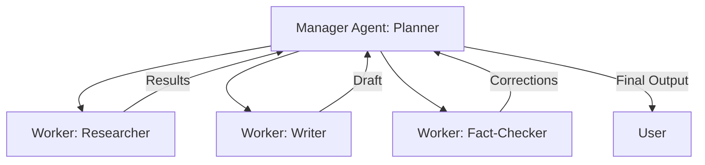

# Multi-Agent Systems

**Module:** 5 | **Level:** Orchestrator | **XP:** 150 | **Estimated Time:** 6 hours

<XpTracker />
<Settings />

## Learning Objectives
- Master the **Manager-Worker** architecture.
- Understand **Autonomous Delegation** vs **Static Coordination**.
- Implement **Agent Communication** protocols (JSON, Async).
- Build a "Council of Agents" for complex problem solving.

## Why This Matters (Real-world Impact)
One agent is good, but a **Team of Agents** is unstoppable. In 2026, we don't build one "Super Agent"; we build specialized agents that talk to each other.
- *Example:* A software development system. Agent 1 writes code, Agent 2 writes tests, and Agent 3 reviews the code. They coordinate to build a bug-free app entirely autonomously.

## Core Concepts

### 1. Coordination Architecture
How do agents talk?


### 2. Delegation Logic
Instead of you telling an agent exactly what to do, the **Manager Agent** uses an LLM to decide: "I should ask the Researcher Agent for the latest stock prices before I tell the Writer Agent to write the report."

## Real-World Examples
1. **Automated Newsletter Factory:** One agent gathers news, another summarizes it, and a third formats it for email.
2. **AI Penetration Testing:** One agent scans ports, another tries to find vulnerabilities, and a third produces the final security report.

## Code Examples (Python)

### 1. The Manager-Worker Pattern
```python
import asyncio

async def worker_agent(role: str, task: str):
    print(f"[{role}] Starting: {task}")
    await asyncio.sleep(2)
    return f"{role} finished {task}"

async def manager_agent():
    print("[Manager] Planning the workflow...")
    # Delegating tasks to specialized workers
    results = await asyncio.gather(
        worker_agent("Researcher", "Search for 2026 AI trends"),
        worker_agent("Analyst", "Calculate the impact of those trends")
    )
    print(f"[Manager] Workflow complete. Results: {results}")

if __name__ == "__main__":
    asyncio.run(manager_agent())
```

### 2. Message Passing Protocol
```python
class AgentMessage:
    def __init__(self, sender: str, receiver: str, content: dict):
        self.sender = sender
        self.receiver = receiver
        self.content = content

# Example of a Researcher sending data to a Writer
msg = AgentMessage("Researcher", "Writer", {"data": "AI is fast.", "source": "Google"})
print(f"Message from {msg.sender} to {msg.receiver}: {msg.content}")
```

## Best Practices & Pro Tips
- **Keep agents small and focused.** An agent that does "everything" is just a bad chatbot.
- **Set a maximum iteration limit.** Avoid infinite loops where two agents keep "correcting" each other forever.
- **Use a shared "State" or "Blackboard"** instead of passing 10GB of data via messages.

## Common Pitfalls & How to Avoid Them
- **Agent Drift:** When agents talk too much to each other, they might wander away from the user's original goal.
- **Deadlocks:** Agent A is waiting for Agent B, while Agent B is waiting for Agent A. Always use timeouts.

## Hands-on Exercises / Homework
- **Beginner:** Create two functions `agent_a()` and `agent_b()`. Make `agent_a` return a string that `agent_b` then prints in uppercase.
- **Intermediate:** Build a "Team" of three mock agents (Search, Math, News) and write a single function that calls them in sequence.
- **Advanced:** Implement an async "Task Manager" that can send the same task to three workers and stop as soon as the first one returns a result (`asyncio.wait`).

## Gamified Challenge
**Story:** You are the *Orchestrator* of the *Digital Hive*.
- *Challenge:* Create a `Swarm` class that can take a list of 5 worker agents. Write a `broadcast(task: str)` method that sends the task to all of them at once. When all are done, print: "The swarm has completed the objective."

## Knowledge Check – MCQs
1. **What is the main advantage of Multi-Agent Systems?**
   - A) They are cheaper.
   - B) They allow for specialization and complex problem-solving.
   - C) They use fewer tokens.
2. **What should you avoid in Multi-Agent communication?**
   - A) Async calls.
   - B) Infinite "Correction" loops.
   - C) JSON formatting.

---
**© 2026 APT Computing Labs** – Apache License 2.0

<ModuleCompletion moduleId="5-multi-agent" :xpValue="150" />
