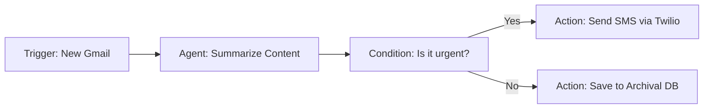

# Workflow Automation & Orchestration

**Module:** 5 | **Level:** Orchestrator | **XP:** 130 | **Estimated Time:** 4 hours

<XpTracker />
<Settings />

## Learning Objectives
- Master **Event-Driven Architecture** for agents.
- Understand **Async Pipeline Design**.
- Implement **Scheduling** for autonomous task execution.
- Build a **Human-in-the-Loop (HITL)** approval step.
- Handle **Error Retries & Fallbacks** in automated workflows.

## Why This Matters (Real-world Impact)
An Agent that just waits for a user's prompt is a "Passive Agent." A **Proactive Agent** that triggers based on an event (like a new email, a price drop, or a daily timer) is a "Workflow Agent."
- *Example:* An agent that automatically checks for new GitHub issues every hour and writes a draft PR for them.

## Core Concepts

### 1. Trigger-Based Workflows
An agent doesn't always start with a user message. It can start with a **Trigger**.


### 2. Human-in-the-Loop (HITL)
For high-stakes tasks (like spending money or deleting files), we insert a **Pause** for human approval.
- **Auto-pilot:** The agent does everything.
- **Co-pilot:** The agent suggests, human clicks "Approve."

## Real-World Examples
1. **Automated Content Pipeline:** Trigger on a new YouTube video link → Agent 1 (Transcribes) → Agent 2 (Summarizes) → Agent 3 (Twitter Thread) → *Human Approval* → Post.
2. **E-commerce Price Monitor:** Schedule an agent to check Amazon every morning → Trigger an alert IF price < $500.

## Code Examples (Python)

### 1. The Async Pipeline Pattern
```python
import asyncio

async def step_1_extraction():
    print("Step 1: Extracting raw data...")
    await asyncio.sleep(2)
    return "Raw data extracted"

async def step_2_analysis(data):
    print(f"Step 2: Analyzing '{data}'...")
    await asyncio.sleep(2)
    return "Analysis results"

async def main_pipeline():
    # Sequence of steps
    data = await step_1_extraction()
    analysis = await step_2_analysis(data)
    print(f"Workflow Complete: {analysis}")

if __name__ == "__main__":
    asyncio.run(main_pipeline())
```

### 2. Simple Retry Logic
```python
import random

async def call_flaky_api():
    if random.random() < 0.7:  # 70% chance of failure
        raise Exception("API Timeout")
    return "Success"

async def workflow_with_retry():
    retries = 3
    for i in range(retries):
        try:
            result = await call_flaky_api()
            print(f"Result: {result}")
            break
        except Exception as e:
            print(f"Attempt {i+1} failed: {e}. Retrying...")
            await asyncio.sleep(1)

# Usage
# asyncio.run(workflow_with_retry())
```

## Best Practices & Pro Tips
- **Use Idempotency.** If an agent fails and restarts, it shouldn't "buy the same pizza twice."
- **Implement Timeouts.** Any automated task should have a `max_execution_time`.
- **Log State Changes.** Always record when a workflow moves from "Started" to "Processing" to "Done."

## Common Pitfalls & How to Avoid Them
- **Cascading Failures:** If Step 1 fails, Step 2 should not even try to run.
- **Rate-Limit Lockouts:** Excessive automated calls can get your API key banned. Use throttlers.

## Hands-on Exercises / Homework
- **Beginner:** Write a loop that executes a function every 5 seconds, up to 3 times.
- **Intermediate:** Create a "Pipeline" where Function A multiplies a number and passes it to Function B, which adds 10.
- **Advanced:** Implement a "HITL Simulation" where an agent asks: "Approve this task? (y/n)". If 'y', it proceeds. If 'n', it stops.

## Gamified Challenge
**Story:** Your agent, *Clockwork*, is in charge of the *Automation Gearbox*.
- *Challenge:* Write an async function `gearbox_pipeline()` that runs three steps in sequence. If any step fails, the agent must try it a second time before printing: "Failed: Maintenance Required."

## Knowledge Check – MCQs
1. **What is 'Human-in-the-Loop' (HITL)?**
   - A) A type of circular loop in Python.
   - B) A design where a human must approve or reject an agent's planned action.
   - C) An AI model that imitates humans.
2. **What should an agent do if an API call fails due to a network error?**
   - A) Delete all its data.
   - B) Retry a few times before giving up.
   - C) Keep trying forever.

---
**© 2026 APT Computing Labs** – Apache License 2.0

<ModuleCompletion moduleId="5-workflow-automation" :xpValue="130" />
