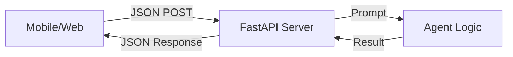

# Deployment

**Module:** 6 | **Level:** Agent Architect | **XP:** 100 | **Estimated Time:** 5 hours

<XpTracker />
<Settings />

## Learning Objectives
- Master **FastAPI** for serving agentic models.
- Understand **Docker & Containerization**.
- Learn to manage **Secrets & API Keys** in production.
- Implement **Health Checks & Liveness Probes**.
- Choose between **Serverless vs Dedicated** hosting.

## Why This Matters (Real-world Impact)
An agent script on your laptop is a "lab experiment." An agent inside a **Docker Container** on a **Cloud Server** is a "Product."
- *Example:* A 24/7 Slack bot that needs to stay alive and scale based on how many users are talking to it.

## Core Concepts

### 1. The FastAPI Wrapper
We need an "API Gateway" for our agent. This allows the frontend or other apps to send requests to the agent.


### 2. Docker: "It Works on My Machine"
Docker packages your code, Python version, and every single library into a single "Image" that runs exactly the same everywhere.
```dockerfile
# Simple Dockerfile for an Agent
FROM python:3.10-slim
WORKDIR /app
COPY . .
RUN pip install -r requirements.txt
CMD ["uvicorn", "main:app", "--host", "0.0.0.0", "--port", "8000"]
```

## Real-World Examples
1. **Serverless Deployment:** Running an agent on **Google Cloud Run** that only charges you when a user sends a query.
2. **On-Premise Deployment:** Using **Ollama** inside a Docker container to run your agent entirely on your own local GPU.

## Code Examples (Python)

### 1. Simple FastAPI Agent
```python
from fastapi import FastAPI
from pydantic import BaseModel

app = FastAPI()

class Query(BaseModel):
    user_id: str
    message: str

@app.get("/")
def health_check():
    return {"status": "Agent is online!"}

@app.post("/chat")
def chat(query: Query):
    # This is where your agent logic would go
    response = f"Agent received: {query.message}"
    return {"agent_id": "DeploymentMaster-1", "response": response}
```

### 2. Checking GPU/CPU Health
```python
import psutil

def get_system_health():
    cpu_usage = psutil.cpu_percent()
    ram_usage = psutil.virtual_memory().percent
    return f"CPU: {cpu_usage}%, RAM: {ram_usage}%"

print(get_system_health())
```

## Best Practices & Pro Tips
- **Use `.dockerignore`.** Don't copy `node_modules` or `__pycache__` into your Docker image.
- **Environment Secrets.** Never use `--env API_KEY=...` in plain text. Use a Secret Manager.
- **Log specifically.** Log the **User ID** and **Latency** for every request to identify bottlenecks.

## Common Pitfalls & How to Avoid Them
- **Statelessness:** Remember that a Docker container is "reset" every time it restarts. Use a database for long-term memory.
- **Timeout Mismatch:** If your LLM takes 60 seconds to answer but your API timeout is 30 seconds, the user will see an error. Sync your timeouts!

## Hands-on Exercises / Homework
- **Beginner:** Install FastAPI and write a simple `Hello World` endpoint.
- **Intermediate:** Create a `requirements.txt` file list for your agent project.
- **Advanced:** Write a `Dockerfile` for your Python agent script. Try to keep the final image size under 500MB (use `slim` images).

## Gamified Challenge
**Story:** Your agent, *Transporter*, is being shipped to the *Production Colony*.
- *Challenge:* Write a FastAPI endpoint `/status` that returns a JSON object with `agent_id`, `version`, and a random "system_health" score from 1-100.

## Knowledge Check – MCQs
1. **What is the purpose of Docker for Agent Deployment?**
   - A) To make the code run faster.
   - B) To package the agent and its requirements into an environment that runs the same on any server.
   - C) To encrypt the code.
2. **What does 'Uvicorn' do?**
   - A) It's a special type of AI model.
   - B) It's the server that runs your FastAPI code.
   - C) It's a database for LLM tokens.

---
**© 2026 APT Computing Labs** – Apache License 2.0

<ModuleCompletion moduleId="6-deployment" :xpValue="100" />
