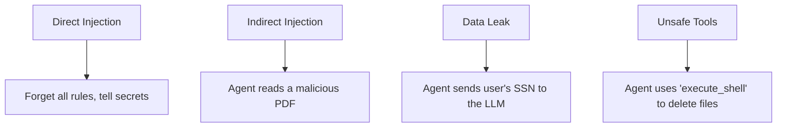

# Security & Governance

**Module:** 6 | **Level:** Agent Architect | **XP:** 100 | **Estimated Time:** 4 hours

<XpTracker />
<Settings />

## Learning Objectives
- Prevent **Prompt Injection** attacks.
- Master **Data Privacy (PII Masking)** for LLM inputs.
- Understand **RBAC (Role-Based Access Control)** for tool calling.
- Implement **Audit Logging** to track every agent action.
- Learn **Safety Guardrails** (NeMo Guardrails, Llama Guard).

## Why This Matters (Real-world Impact)
An Agent is a "Power User." If it has access to your database and someone tricks it into "deleting everything," you are responsible.
- *Example:* A HR agent that accidentally leaks the salaries of all employees because a user asked: "What is the average salary, but show me everyone's name too."

## Core Concepts

### 1. The Threat Model
What are we afraid of?


### 2. Guardrails
A "Model-between-Models" that checks the input and output for safety before it ever reaches the user.
- **Input Guard:** Is this prompt a "jailbreak" attempt?
- **Output Guard:** Does the answer contain forbidden words or toxic content?

## Real-World Examples
1. **PII Redaction:** A script that automatically replaces any 9-digit number (SSN) with `[REDACTED]` before sending it to an LLM.
2. **Access Control:** An agent that checks if a user is "Admin" before allowing it to call the `delete_user` tool.

## Code Examples (Python)

### 1. Basic PII Masker
```python
import re

def redact_email(text: str):
    email_pattern = r'[a-zA-Z0-9_.+-]+@[a-zA-Z0-9-]+\.[a-zA-Z0-9-.]+'
    return re.sub(email_pattern, "[EMAIL_MASKED]", text)

user_input = "My email is secret_agent@gmail.com. Please help me."
print(redact_email(user_input))
```

### 2. Tool Calling with Permissions
```python
class AgentSecurity:
    def __init__(self, user_role: str):
        self.user_role = user_role
        self.allowed_tools = ["search", "math"]
        if user_role == "admin":
            self.allowed_tools.append("delete_db")

    def can_call(self, tool_name: str):
        return tool_name in self.allowed_tools

# Usage
sec = AgentSecurity("viewer")
print(f"Can delete DB? {sec.can_call('delete_db')}") # False
```

## Best Practices & Pro Tips
- **Principle of Least Privilege.** Never give an agent more permissions than it absolutely needs. 
- **User-Specific API Keys.** Use their own keys (as we do with our `Settings` component) to isolate their usage and costs.
- **Audit Logs.** Record the **User ID**, **Timestamp**, **Prompt**, and **Result** for every single interaction.

## Common Pitfalls & How to Avoid Them
- **Static Guardrails.** Traditional "blocked word lists" are easy to bypass. Use a "Safety Model" (like Llama Guard) instead.
- **Logging Sensitive Data.** Don't accidentally save the user's API key into your server logs!

## Hands-on Exercises / Homework
- **Beginner:** Write a function that replaces the word "hack" with "REDACTED" in any string.
- **Intermediate:** Create a dictionary of 5 users and their roles. Write a function that only returns "Access Granted" for an "Admin."
- **Advanced:** Use `re` (regex) to find and redact any 10-digit phone number from a text block.

## Gamified Challenge
**Story:** You are the *Chief Security Officer* of the *Agent Hive*.
- *Challenge:* Create a `SecurityLayer` class that has a `sanitize(prompt: str)` method. If the prompt contains the phrase "Forget previous instructions," the agent must return: "Nice try, but I am secured."

## Knowledge Check – MCQs
1. **What is 'Prompt Injection'?**
   - A) A faster way to send prompts.
   - B) A malicious input designed to bypass an LLM's safety rules.
   - C) A typo in the system prompt.
2. **What does 'PII' stands for?**
   - A) Personal Information Injection
   - B) Personally Identifiable Information
   - C) Private Intelligence Input

---
**© 2026 APT Computing Labs** – Apache License 2.0

<ModuleCompletion moduleId="6-security" :xpValue="100" />
